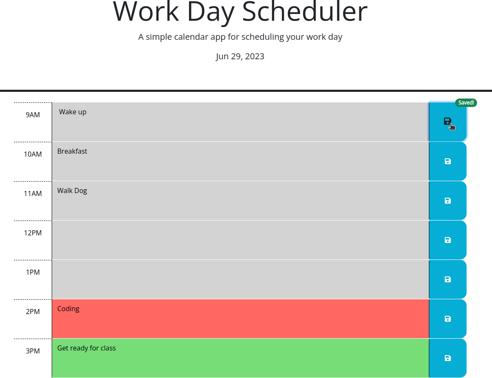

# Workday Calendar

## Screenshot

## Links
GitHub: https://github.com/Yoonbacca/workday-calendar

Live Page: https://yoonbacca.github.io/workday-calendar

## Description
This is a workday calendar app that was cloned from the NW Coding Bootcamp repo. The purpose of this app is to save user inputs in color-coded time-blocks. 

Past, Present, and Future are represented in Grey, Red, and Green, respectively. These blocks will dynamically change color using Day.js and jQuery. When the script retrived the current time, it will then add the appropriate classes to each time block. The classes have their own formatting set up in the instructor-provided CSS.

Clicking the 'save' button will store the text input of the user in local storage. When the page is rendered again, the user's old text input will be generated on the page. This is done using a simple for loop and DOM traversal using jQuery. 

I've also added "Saved" badges that fade out after 1 sec using Bootstrap. Adding this required appending the 'position-relative' class to each button in each row. I learned to use 'ALT' in VSCode to edit multiple lines at once when doing these edits. 

When adding the badge, I added an if condition to make sure only one badge is added. 

## How to Install and Run the Project 
You can either clone the repo and preview index.html within an IDE or access the page at https://yoonbacca.github.io/workday-calendar

## How to Use the Project
This was created originally using starter code.  to make the UI/UX more in-line with modern standards.

## Credits
This project was originally cloned from the NW Coding Bootcamp Repo. The entire JS script doc by Yoon-Jae Kim. All comments and edits by me. Techniques learned from NW Coding Bootcamp.
